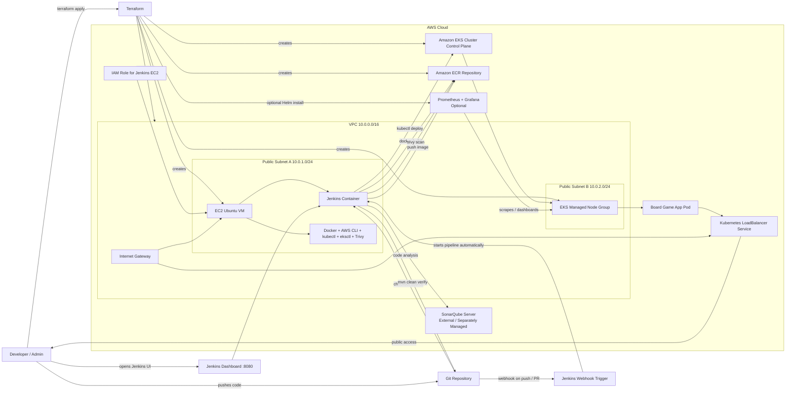
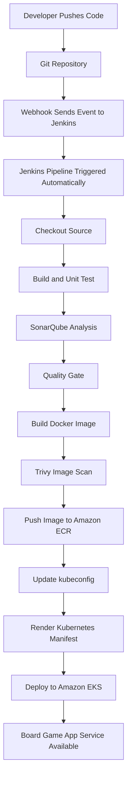

# Jenkins Project Architecture Diagram

## Mermaid Diagram

## Pipeline Flow

## Short Description

- Terraform provisions the AWS network, EC2 Jenkins server, IAM roles, ECR, EKS, and optional monitoring.
- Jenkins runs on an EC2 instance inside Docker and acts as the CI/CD controller.
- A Git webhook triggers Jenkins automatically whenever code is pushed or a pull request event is configured.
- Jenkins builds the Spring Boot app, scans it, pushes the image to ECR, and deploys it to EKS.
- The application is exposed through a Kubernetes `LoadBalancer` service.
- Prometheus and Grafana can be enabled through `monitoring.tf`.

## Presentation Labels

Use these labels if you want to redraw this in PowerPoint:

- User / Developer
- Git Repository
- Webhook Trigger
- Terraform
- AWS Cloud
- VPC
- Public Subnet A
- Public Subnet B
- Jenkins EC2 Instance
- Jenkins Container
- Docker / AWS CLI / kubectl / eksctl / Trivy
- IAM Role
- Amazon ECR
- Amazon EKS Control Plane
- EKS Node Group
- Board Game Application
- Kubernetes LoadBalancer Service
- Prometheus
- Grafana
- SonarQube
